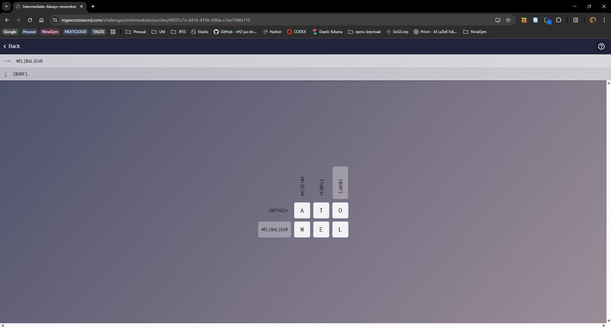
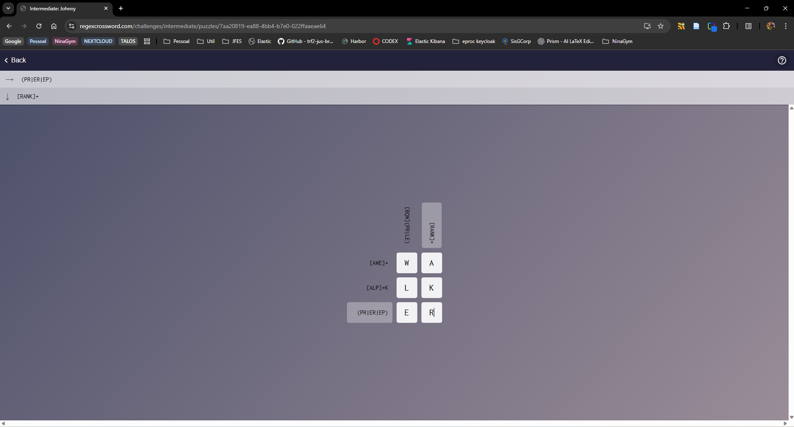
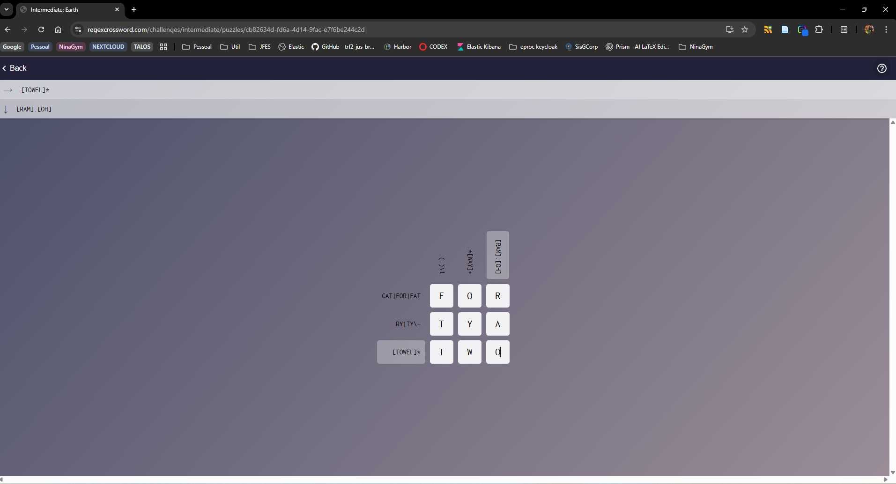
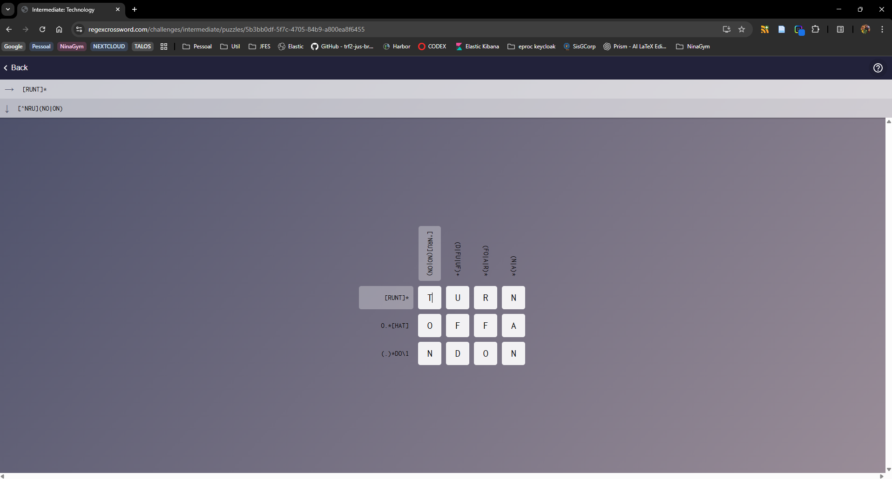
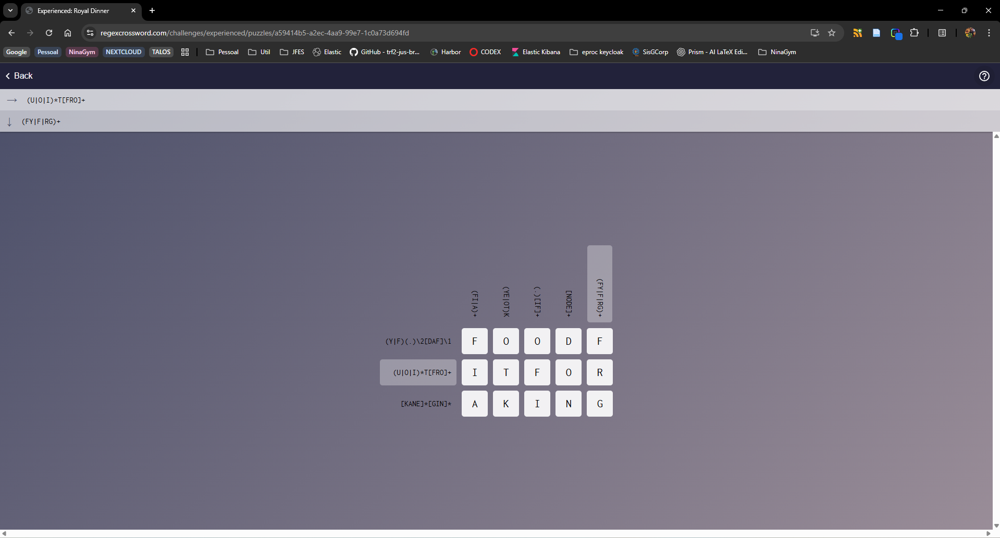

# Teoria da Computação

Este repositório contém um projeto desenvolvido para o curso de Computação Aplicada do IFES, com o professor Jefferson Andrade.

## Execução do programa

### Parte 1: Conversão de Autômatos (NFAɛ → DFA): Programa lab01-part1

O progrma **lab01-part1** converte um NFA-e em NFA ou um NFA em DFA. Além de apresentar os passos da conversão em tela, o programa também grava o novo autômato em arquivo.

* Arquivos de saída:
  * nfae-nfa.yaml
  * nfa-dfa.yaml

### Parte 2: Implementação de Expressões Regulares: Programa lab01-part2

O programa **lab01-part2** le uma expressao regular e gera um automato no formato NFAe usando a construcao de Thompson.

Operadores suportados:
* Concatenacao: `ab`
* Uniao: `a|b`
* Fecho de Kleene: `a*`
* Uma ou mais repeticoes: `a+`
* Opcional: `a?` (equivalente a `(a|epsilon)`)

Entrada YAML (exemplo):

```yaml
expression: "(a|b)*abb"
```

Execucao:

```bash
cabal run lab01-part2 -- lab01-part2.yaml
```

Arquivo de saida:
* regex-nfae.yaml
* regex-nfae.puml

Para visualizar o automato usando PlantUML:

```bash
plantuml regex-nfae.puml
```

### Parte 3: Regex Crossword

Abaixo estão os prints que demonstram a resolução de 5 regex crossword. Sendo 4 deles nível Intermediário e 1 nível Experiente.











E a seguir, o link para o regex crossword 5x5 criado como parte 3 do trabalho:
[TC-FABRIZIO](https://regexcrossword.com/playerpuzzles/69e8160c7a4b5)
